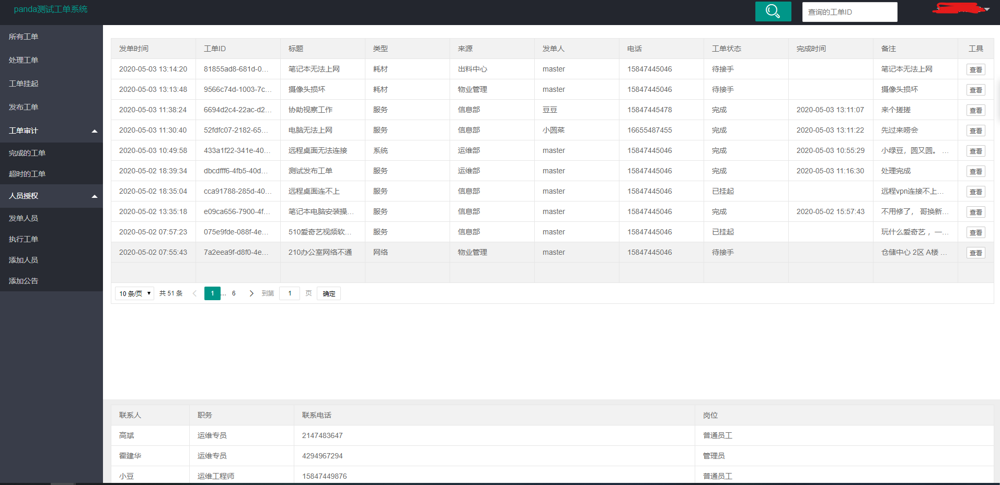
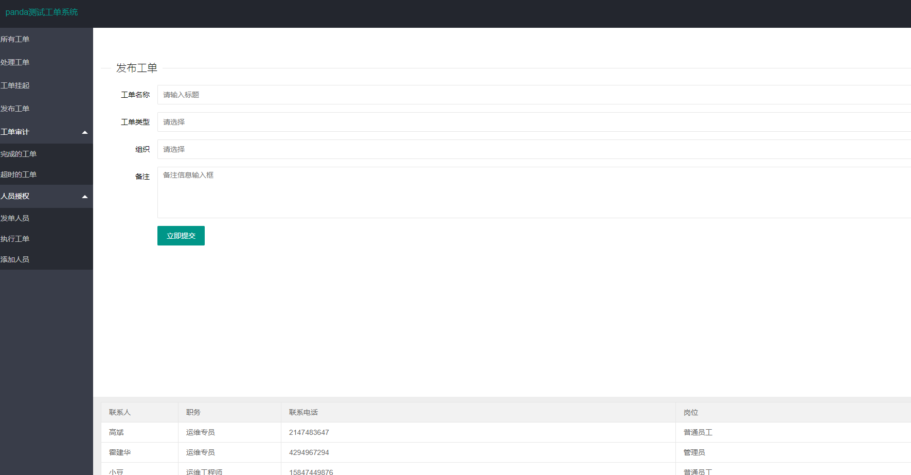
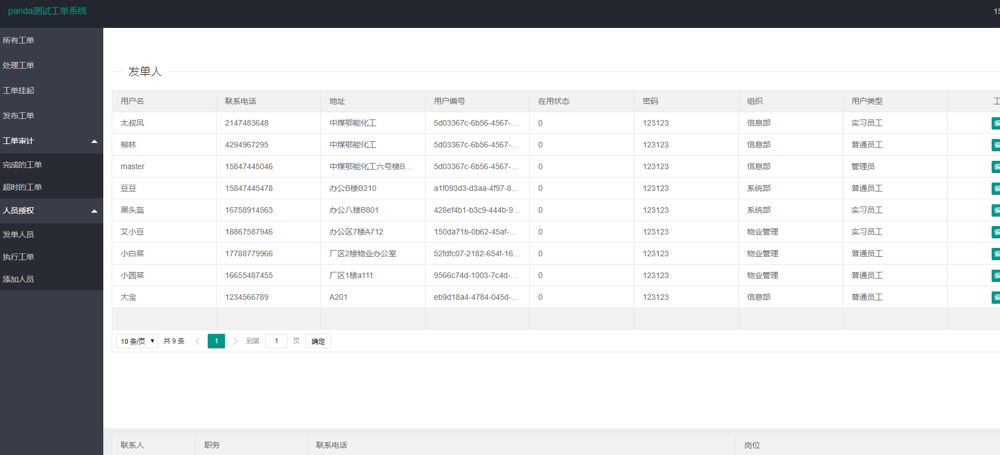

## 功能介绍

基于go语言开发的工单后台管理系统

发单人发布工单，收单人处理工单。 管理员对于人员做审计和工单做审计及上传公告

流程示意图：


## 开发环境

```powershell
go version go1.13.6 windows/amd64
github.com/astaxie/beego v1.12.1
github.com/dgrijalva/jwt-go v3.2.0+incompatible
github.com/gofrs/uuid v3.2.0+incompatible
github.com/jinzhu/gorm v1.9.12

mariadb[5.6]
```


## 部署要求

```shell
##Centos 7/8 firewall 开启8080 修改配置文件的mysql链接地址 导入sql文件（sql 文件在 conf 目录）

#1 配置数据库
yum install mariadb 
firewall-cmd --add-port=3306/tcp --permanent 
mysql 
source /xxx/xxx/conf/backup_2020-5-3.sql
grant all on ticket_system.* to "xx"@"%" identified by 'passowrd';

#2 修改conf文件夹下的app.conf文件带##都是需要自定义的
appname = OrdsOrder
httpport = 8080 ##
runmode = dev
copyrequestbody = true
mysqluser = "root"  ##
mysqlpass = "123123" ##
mysqlurls = "192.168.1.119" ##
mysqldb   = "ticket_system" ##

#3 修改conf文件夹下的order.service,然后将文件拷贝到/usr/lib/systemd/system/ 
#  systemctl enable order.service --new
[Unit]
Description=Sys order server damon 
After=network-online.target
Wants=network-online.target

[Service]
# modify when deploy in prod env
User=root ##
Group=root ##

Type=simple
ExecStart=/xxx/xxx/OrdsOrder ## 你的执行文件的路径
WorkingDirectory=/xxx/xxx/ ##执行文件的目录

Restart=always
RestartSec=1
StartLimitInterval=0

[Install]
WantedBy=multi-user.target
```


## 实现效果








